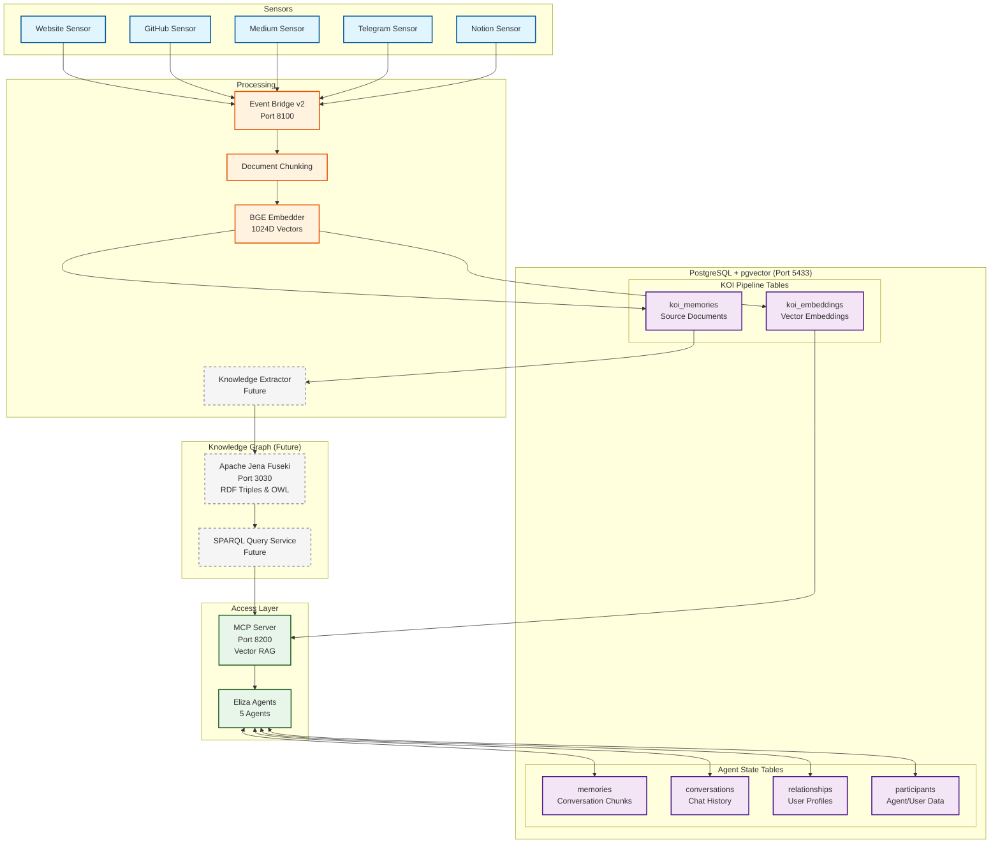

# KOI Pipeline Data Flow Documentation

## Executive Summary

The KOI (Knowledge Organization Infrastructure) pipeline implements a sophisticated data flow from diverse sensors through processing and storage layers to agent-accessible knowledge. This document clarifies the complete data flow and storage architecture.

## Architecture Overview



## Storage Systems Explained

### PostgreSQL with pgvector (ACTIVE)
All tables are in the **same PostgreSQL database** (`eliza` on port 5433):

**KOI Pipeline Tables**:
- `koi_memories`: Source documents from sensors
- `koi_embeddings`: Vector embeddings (1024D) for semantic search
- pgvector extension enables vector operations

**Agent Tables** (direct access):
- `memories`: Agent memories from conversations and KOI chunks
- `conversations`: Full conversation history
- `relationships`: Agent relationship tracking
- `participants`: User/agent profiles

**Not separate**: pgvector is an extension to PostgreSQL, not a separate database

### Apache Jena Fuseki (FUTURE)
Knowledge graph triplestore for semantic relationships:
- **Port**: 3030 (when deployed)
- **Purpose**: Store RDF triples extracted from content
- **Status**: Not yet integrated (marked "Future" in diagram)
- **Will store**: Entities, relationships, ontologies

### Current vs Future State

**Currently Active:**
- ✅ PostgreSQL with all three tables
- ✅ BGE embeddings (1024-dimensional)
- ✅ MCP Server for vector RAG
- ✅ Document chunking and deduplication

**Future Components:**
- ⏳ Knowledge Extractor (entity/relationship extraction)
- ⏳ Apache Jena integration
- ⏳ SPARQL query service
- ⏳ Hybrid search (vector + graph)

## Detailed Data Flow

### 1. Collection Phase
**Location**: Various sensor implementations
**Output**: Raw documents with metadata

```python
# Example: GitHub sensor collects README.md
{
    "rid": "github:regen-ledger:README.md",
    "content": "# Regen Ledger\n\nComprehensive documentation...",
    "metadata": {
        "source": "github",
        "repo": "regen-ledger",
        "collected_at": "2025-09-13T07:30:00Z"
    }
}
```

### 2. Event Processing
**Location**: KOI Event Bridge v2
**Operations**:
- RID-based deduplication
- Document chunking (1000 tokens default)
- Metadata enrichment
- Version tracking

```python
# Processing flow
async def process_koi_event(event):
    # Check for duplicates
    if await check_rid_exists(event.rid):
        return {"chunks": 0, "embeddings": 0}  # Skip
    
    # Chunk document
    chunks = chunk_document(event.content)  # e.g., 1 doc → 5 chunks
    
    # Store original in koi_memories
    await store_koi_memory(event)
    
    # Store chunks in memories table
    for chunk in chunks:
        await store_memory_chunk(chunk)
    
    # Generate embeddings
    embeddings = await generate_embeddings(chunks)
    await store_embeddings(embeddings)
```

### 3. Storage Layer

#### Table: `koi_memories`
**Purpose**: Preserve original documents
**Count**: ~26 documents (Sept 2025)

| Column | Purpose | Example |
|--------|---------|---------|
| id | UUID | `a1b2c3d4-...` |
| rid | Resource ID | `github:regen-ledger:README.md` |
| content | Full document | `{"text": "Complete README content..."}` |
| source_sensor | Origin | `github-sensor` |
| version | Version number | `1` |

#### Table: `memories`
**Purpose**: Agent-accessible chunks
**Count**: 40,479+ chunks (Sept 2025)

| Column | Purpose | Example |
|--------|---------|---------|
| id | UUID | `e5f6g7h8-...` |
| content | Chunk text | `{"text": "Regen Ledger is a blockchain..."}` |
| agentId | Agent access | `8e1e4498-b3c8-0fae-ad1f-e90d1c1a4331` |
| createdAt | Timestamp | `2025-09-13 07:30:00` |

#### Table: `koi_embeddings`
**Purpose**: Semantic search vectors
**Count**: 26 embeddings (matches koi_memories)

| Column | Purpose | Dimension |
|--------|---------|-----------|
| memory_id | Link to koi_memories | UUID |
| dim_1024 | BGE embedding | 1024D vector |
| dim_768 | Alternative model | 768D vector |
| dim_1536 | OpenAI compatible | 1536D vector |

## Real-World Example

### GitHub Sensor Processing

**Input**: `regen-ledger` repository with 81 documents

**Processing**:
1. Sensor collects 81 markdown files
2. Event Bridge processes each:
   - Checks RID for duplicates
   - Chunks large documents
   - Total: 81 docs → ~600 chunks

**Storage Results**:
- `koi_memories`: 81 entries (one per document)
- `memories`: ~600 entries (multiple chunks per doc)
- `koi_embeddings`: 81 entries (one per document)

**Query Access**:
```sql
-- Original documents
SELECT * FROM koi_memories WHERE source_sensor = 'github-sensor';
-- Returns: 81 rows

-- Searchable chunks
SELECT * FROM memories WHERE content::text LIKE '%github%';
-- Returns: ~600 rows

-- Semantic search via MCP
curl -X POST http://localhost:8200/search \
  -d '{"query": "carbon credits", "limit": 5}'
-- Returns: Top 5 relevant chunks with similarity scores
```

## Deduplication Explained

The "0 chunks, 0 embeddings" message indicates successful deduplication:

```
INFO: [KOI Bridge v2] Successfully processed: 0 chunks, 0 embeddings
```

This means:
- Document RID already exists in `koi_memories`
- No new processing needed
- System working correctly to prevent duplicates

## Storage Growth Patterns

### Daily Statistics (Sept 13, 2025)
- **New source documents**: ~200 (GitHub, websites, Medium)
- **New chunks created**: ~1,500
- **Deduplication rate**: ~80% (most content already indexed)

### Storage Efficiency
- **Compression ratio**: 1:7.5 (1 document → ~7.5 chunks average)
- **Embedding coverage**: 100% of koi_memories have embeddings
- **Query performance**: <200ms for similarity search

## Agent Data Access Patterns

Eliza agents use **two distinct access patterns** for different types of data:

### 1. Direct PostgreSQL Access (Agent State)
Agents connect directly to PostgreSQL for:
- **Writing memories**: Storing new memories from conversations
- **Reading memories**: Retrieving historical conversation context
- **Managing conversations**: Full conversation history and threads
- **Tracking relationships**: User profiles and agent relationships

This direct connection allows agents to:
- Persist conversation state immediately
- Query their own conversation history
- Build user profiles over time
- Maintain context across sessions

### 2. MCP Server Access (Knowledge Base)
The MCP (Model Context Protocol) server provides agent access to KOI knowledge:

**Endpoint**: `http://localhost:8200`

**Capabilities**:
- Semantic search across all KOI chunks
- RID-based document retrieval
- Agent-specific filtering
- Real-time knowledge updates from sensors

**Example Query**:
```json
POST /search
{
    "query": "regenerative agriculture",
    "limit": 10,
    "similarity_threshold": 0.7,
    "agent_id": "optional-agent-filter"
}
```

**Response**:
```json
{
    "success": true,
    "memories": [
        {
            "rid": "github:regen-ledger:...",
            "content": "Regenerative agriculture practices...",
            "similarity": 0.85,
            "metadata": {...}
        }
    ],
    "count": 10
}
```

## Monitoring & Verification

### Health Checks
```bash
# Pipeline status
curl http://localhost:8005/health  # Coordinator
curl http://localhost:8100/         # Event Bridge
curl http://localhost:8200/         # MCP Server

# Database statistics
psql -d eliza -c "
  SELECT 
    'koi_memories' as table_name, COUNT(*) as count 
  FROM koi_memories
  UNION ALL
  SELECT 
    'memories' as table_name, COUNT(*) 
  FROM memories
  WHERE \"createdAt\" > NOW() - INTERVAL '24 hours';"
```

### Log Monitoring
```bash
# Event processing
tail -f /opt/projects/koi-processor/logs/event_bridge_new.log

# Sensor activity
tail -f /opt/projects/koi-sensors/logs/*.log

# MCP queries
tail -f /opt/projects/koi-processor/logs/mcp_server.log
```

## Common Issues & Solutions

### Issue: "Only 26 documents in database"
**Reality**: 26 source documents generated 40,000+ searchable chunks
**Check**: Query the `memories` table for actual content

### Issue: "Pipeline not processing new content"
**Reality**: Deduplication preventing reprocessing
**Check**: Look for new RIDs in `koi_memories` table

### Issue: "MCP search returns no results"
**Check**: 
1. BGE embeddings generated correctly
2. Similarity threshold not too high (default 0.7)
3. Content actually contains query terms

## Performance Metrics

### Current Production Stats (Sept 2025)
- **Sensors active**: 5 (Website, GitHub, Medium, Notion, Telegram)
- **Documents processed**: 200+ per day
- **Chunks generated**: 1,500+ per day
- **Query latency**: <200ms average
- **Deduplication rate**: 80%
- **Storage growth**: ~50MB per day

### Scalability
- **Document capacity**: 1M+ documents
- **Chunk capacity**: 10M+ chunks
- **Query throughput**: 100+ QPS
- **Embedding generation**: 50 docs/minute

## Future Enhancements

1. **Incremental chunking**: Smart rechunking on updates
2. **Multilingual support**: Beyond English content
3. **Graph relationships**: Link related chunks
4. **Compression**: Reduce storage footprint
5. **Caching layer**: Speed up frequent queries

---

*Last Updated: September 13, 2025*
*Version: KOI Pipeline v2.0*
*Status: Production*