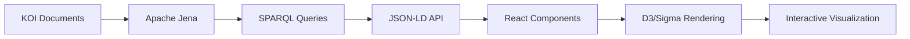

# KOI Knowledge Graph Visualization Strategy

## Executive Summary

Based on comprehensive research of RDF visualization tools and KOI's specific requirements (Apache Jena + RDF/SPARQL, essence alignments, provenance tracking), this document outlines a tiered visualization strategy optimized for the Knowledge Organization Infrastructure ecosystem.

## KOI-Specific Requirements

### Core Data Architecture
- **Triple Store**: Apache Jena with RDF/SPARQL/OWL
- **Unique Identifiers**: RID (Resource ID) + CID (Content ID) dual system
- **Provenance**: CAT (Content Addressable Transformation) receipts
- **Essence Alignments**: Re-Whole Value, Nest Caring, Harmonize Agency detection
- **Ontologies as Assets**: First-class knowledge graph entities with transformation tracking

### Visualization Priorities
1. **Semantic Relationship Exploration**: Navigate metabolic processes, discourse patterns, and essence alignments
2. **Provenance Visualization**: Track document transformations and ontology evolution via CAT receipts
3. **Multi-scale Navigation**: From document chunks to system-wide metabolic patterns
4. **Query Interface**: SPARQL query builder with visual feedback
5. **Essence Pattern Recognition**: Highlight documents/entities exhibiting specific essence alignments

## Recommended Multi-Tier Architecture

### Tier 1: Core SPARQL Interface
**Tool**: Apache Jena Fuseki + Custom Query Builder
- Web-based SPARQL endpoint with KOI-aware query templates
- Pre-built queries for common KOI operations (essence detection, provenance tracing)
- JSON-LD output for downstream visualization

### Tier 2: Interactive Graph Exploration
**Tool**: D3.js + Sigma.js Hybrid Approach
- **D3.js** for custom KOI-specific visualizations (essence alignment radials, provenance timelines)
- **Sigma.js** for large-scale network exploration (>10K nodes)
- WebGL acceleration for performance with full dataset (~1,116 documents)

### Tier 3: Ontology Visualization
**Tool**: VOWL + Custom OWL Extensions
- Visual ontology browser for regen-unified-ontology.ttl
- Custom extensions for KOI's RID/CID metadata
- Integration with ontology transformation provenance

## Implementation Plan

### Phase 1: SPARQL Foundation (Week 1)
```bash
# Apache Jena Fuseki setup with KOI dataset
fuseki-server --loc=./koi-triplestore --port=3030 /koi

# Custom query templates for KOI patterns
GET /koi/sparql?query=SELECT ?doc ?essence WHERE { 
  ?doc regen:hasEssenceAlignment ?essence 
}
```

### Phase 2: Web Application Core (Weeks 2-3)
```javascript
// React + D3.js integration for KOI visualization
class KOIGraphVisualizer extends React.Component {
  renderEssenceAlignment(documents) {
    // Custom D3 radial layout for essence pattern visualization
    const essenceRadial = d3.forceSimulation(documents)
      .force("essence", d3.forceRadial(r => essenceRadius[r.essence]))
      .force("collision", d3.forceCollide(5));
  }
  
  renderProvenanceChain(catReceipts) {
    // Timeline visualization for CAT receipt chains
    const timeline = d3.scaleTime()
      .domain(d3.extent(catReceipts, d => d.timestamp));
  }
}
```

### Phase 3: Advanced Features (Week 4)
- Sigma.js integration for large graph exploration
- SPARQL query builder with visual drag-drop interface
- Real-time updates via WebSocket connection to Fuseki

## KOI-Specific Visualization Components

### 1. Essence Alignment Radar
```javascript
// Multi-dimensional essence visualization
const essenceRadar = {
  dimensions: [
    "Re-Whole Value",
    "Nest Caring", 
    "Harmonize Agency"
  ],
  renderDocument: (doc) => {
    // Radar chart showing essence alignment strengths
    return d3.radialArea()
      .angle(d => essenceScale(d.dimension))
      .radius(d => alignmentScale(d.score));
  }
};
```

### 2. Metabolic Process Flow
```javascript
// Hierarchical visualization of metabolic relationships
const metabolicFlow = d3.hierarchy(metabolicData)
  .sum(d => d.documentCount)
  .sort((a, b) => b.height - a.height || b.value - a.value);

const treemap = d3.treemap()
  .size([width, height])
  .padding(d => d.height);
```

### 3. Provenance Timeline
```javascript
// CAT receipt chain visualization
const provenanceTimeline = {
  renderTransformation: (catReceipt) => {
    return {
      sourceRID: catReceipt.sourceRID,
      targetRID: catReceipt.targetRID,
      transformation: catReceipt.transformationType,
      timestamp: catReceipt.created,
      confidence: catReceipt.confidence
    };
  }
};
```

## Technical Stack

### Frontend
- **React 18** + TypeScript for component architecture
- **D3.js v7** for custom KOI visualizations
- **Sigma.js v2** for large graph performance
- **Apache ECharts** for statistical dashboards
- **Tailwind CSS** for responsive design

### Backend Integration  
- **Apache Jena Fuseki** SPARQL endpoint
- **WebSocket** for real-time graph updates
- **GraphQL** wrapper for complex KOI queries
- **Redis** caching for frequent essence alignment queries

### Data Pipeline


## Performance Considerations

### Large Dataset Optimization
- **Virtualization**: Load visible nodes only (Sigma.js native support)
- **Level-of-Detail**: Progressive graph revelation based on zoom level  
- **Query Optimization**: Indexed SPARQL queries for essence alignments
- **Caching Strategy**: Redis cache for frequent RID/CID lookups

### Memory Management
```javascript
// Efficient node management for 1,116+ documents
const nodeManager = {
  visibleNodes: new Map(),
  hiddenNodes: new WeakMap(),
  
  showNode(rid) {
    if (this.hiddenNodes.has(rid)) {
      this.visibleNodes.set(rid, this.hiddenNodes.get(rid));
      this.hiddenNodes.delete(rid);
    }
  }
};
```

## Integration with KOI Ecosystem

### 1. Unified Ontology Integration
- Real-time ontology updates from regen-unified-ontology.ttl
- Visual diff for ontology transformations via CAT receipts
- Class hierarchy exploration with instance count overlays

### 2. Essence Detection Pipeline
- Visual feedback for Mistral 7B entity extraction results
- Confidence scoring visualization for essence alignments
- Interactive refinement of extraction parameters

### 3. Registry Framework Alignment
- Visualization of "credits as claims" relationships
- Regen Network integration points highlighted in graph
- MRV (Measurement, Reporting, Verification) data flow visualization

## Success Metrics

### User Experience
- **Query Response Time**: <2s for common SPARQL patterns
- **Graph Rendering**: <5s for 1,000+ node visualizations  
- **Interactive Performance**: 60fps pan/zoom/hover operations
- **Mobile Responsiveness**: Functional on tablet devices

### Knowledge Discovery
- **Pattern Recognition**: Visual identification of essence alignment clusters
- **Provenance Tracing**: One-click navigation through CAT receipt chains
- **Semantic Exploration**: Intuitive discovery of metabolic process relationships
- **Research Acceleration**: Reduced time-to-insight for KOI dataset analysis

## Next Steps

1. **Setup Apache Jena Fuseki** with full KOI dataset once processing completes
2. **Develop React prototype** with basic D3.js essence alignment visualization  
3. **Integrate SPARQL query builder** with KOI-specific templates
4. **Add Sigma.js layer** for large-scale graph exploration
5. **Deploy web application** with real-time updates from processing pipeline

This visualization strategy positions KOI as a cutting-edge knowledge organization platform with best-in-class graph exploration capabilities, optimized for regenerative systems research and metabolic pattern discovery.